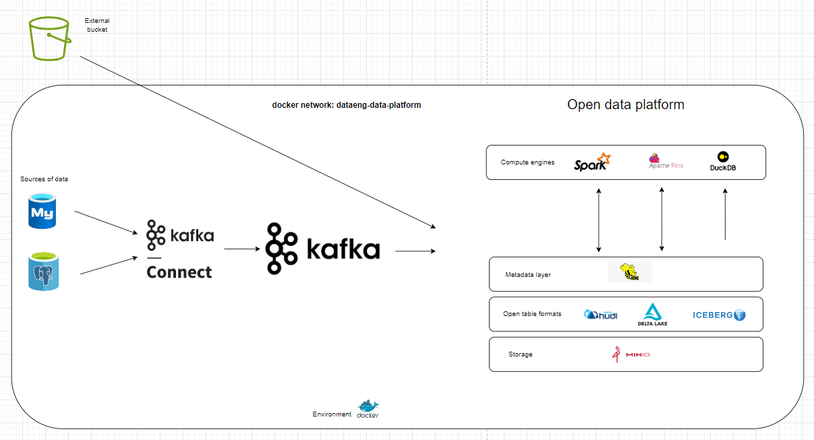

# data-platform-infru
This repository contains docker-compose setups to build a data platform from open source tools. \
Can be used to setup a playground and learn about batch or streaming data processing.
<br></br>
# Require
### **** Create the docker network to deploy all apps in the `dataeng-data-platform` 
```
docker network create dataeng-data-platform
```
<br></br><br></br>


### Apps 
[data-generator](./data-generator/): python scripts to push data in mysql, postgresql or kafka\
[flink](./flink/): flink cluster with python installed, used to practice pyflink api \
[hive-metastore](./hive-metastore/): a hive metastore, configured to integrate with minIO setup as storage \
[kafka](./kafka/): zookeeper and kafka broker\
[minIO](./minIO): object storage, s3 compatible\
[mysql-maxwell](./mysql-maxwell): consume cdc from mysql using maxwell\
[postgresql-kafkaconnect](./postgresql-kafkaconnect/): consume cdc from postgresql using kafka connect\
[spark](./spark/): spark cluster with 2 worker nodes


### Example - spin up the services for a lakehouse 

```
docker network create dataeng-data-platform
docker-compose -f ./minIO/docker-compose.yml up -d
docker-compose -f ./hive-metastore/docker-compose.yml up -d
docker-compose -f ./spark/docker-compose.yml up -d
docker exec spark-master spark-submit /opt/spark-apps/test_job.py
```

In case a port is already binded, find the process that use the port:
``sudo lsof -t -i:5432``